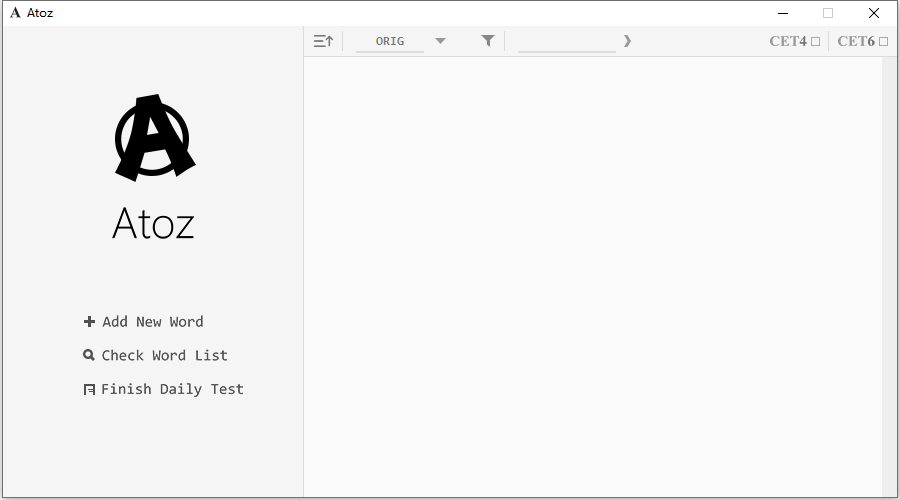

# Atoz

## 介绍

这是一个用java写的背单词小程序

为什么要写这么一个程序呢？因为考四六级要背单词，手机里找的那些背单词软件都不太符合我背单词的习惯（主要还是觉得好玩所以才做的。不过不管怎么说，自己用自己写的背单词软件才有背下去的动力嘛。

这个程序和一般的背单词软件不太一样的地方就是，你需要**手动**输入一张单词表（~~其实还不是因为做得太简陋了连四六级词库都没有~~，内容包含单词名、译名、默认熟练度还有勾选是否为四级或六级单词。然后有一个每日一测，程序会自动生成一套题目让你来做。当然你也可以一天做好几遍，只不过除去第一次以外的测试结果都不会计入到熟练度统计里面去，所以如果要提高熟练度，唯一的办法就是每天开始做测试之前要好好背一遍单词以提高正确率，~~当然你也可以通过修改同级目录下的`word_list.atz`文件达到瞬间精通的效果~~。

因为本人不是计算机相关专业的，对swing程序的编写也就是入门的水平，所以目前来说这个程序写得还比较简陋。比如文件读写的部分完全是靠自己写的，没怎么考虑到过有人乱改词库表会发生什么的情况（所以还是不要乱改那个表为好吧（恳求，还有就是单词类的部分，没考虑到过一词多义、词性不同还有发音等问题（其实除了发音都好说。这些不完善的地方肯定是要改的，至于后续更新嘛，等寒假再说吧

## 使用方法

+ 版本选择

    程序有两个版本，一个是需要你的电脑上安装了java的[版本](https://github.com/Gelinzh/Atoz/releases/download/1.0.1/Atoz_v1.0.1.exe)（推荐），一个是内部[附带jre](https://github.com/Gelinzh/Atoz/releases/download/1.0.0Jre/Atoz_withJre_v1.0.0.exe)的版本，根据自己的需要选择吧

+ 初始界面

    开始运行程序，你会得到一个这样的默认界面

    

    还有同级目录下的`word_list.atz`和`config.cfg`文件，分别是单词库文件和配置文件。由于目前程序尚未有什么其他功能选项，配置文件目前仅用于记录每日测试的相关内容。

+ 添加单词

    点击`Add New Word`按钮，将页面切换至添加单词页

    

    在这里你可以添加你想添加的单词，注意`Word Name`项和`Translation`项是必填的

    + `Word Name`项填写规则遵循正则表达式：`"^(\w+-?)+(\w+)$"`

    + `Translation`项没有填写规则，建议填入的汉字数少于七个，不然容易显示不全

    + `Proficiency`项为初始熟练度，一共有五个等级：

        + E：完全陌生，不认识这个单词
        + D：有点眼熟，但是说不上准确的意思
        + C：能准确地说出单词对应的译名
        + B：能准确地拼写单词
        + A：能熟练掌握单词用法，并运用到写作当中

        你可以根据如上的对应关系设置初始熟练度

    + `CET4`和`CET6`选框为选择单词是否在四级或六级的考试范围内

+ 查看列表

    点击`Check Word List`按钮，将页面切回单词列表页

    

    在添加完一些单词后，它们应该会在这个页面显示出来

    列表上方的控件，从左到右分别是：

    + 升/降序切换：点击以切换单词排列的升降序；
    + 排序方法切换：点击选择排序方法，可以根据首字母、添加日期和熟练度排序；
    + 搜索过滤：输入关键字以精确检索单词
    + CET4/CET6：勾选后根据是否为四六级单词过滤列表

+ 每日测试

    点击`Daily Test`按钮，将页面切换至每日测试页

    

    右上的第一个滑条控制生成题目组数（最少为1，最多为4），下拉菜单控制是从已筛选的列表中抽取单词还是从整个单词库里抽取单词。题目类型分为选择题和默写题，选择题又分为一半英译中，一半中译英，CDE类单词参与选择题，ABC类单词参与默写题，程序会根据目前有的单词数目选择对应的题组类型：

    + 如果单词数足够，则会生成每组10个选择题，5个默写题；

    + 如果只有CDE类单词够，则会生成每组10个选择题；
    + 如果只有ABC类单词够，则会生成每组10个默写题；
    + 如果都不够，则不会生成题目。